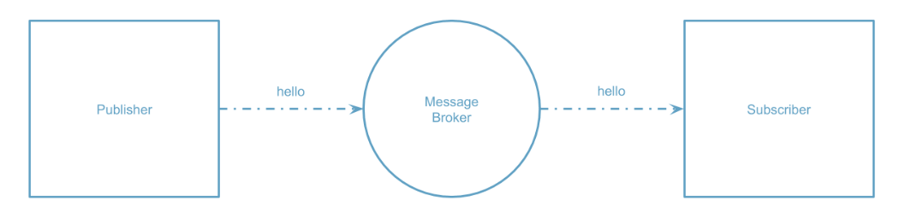
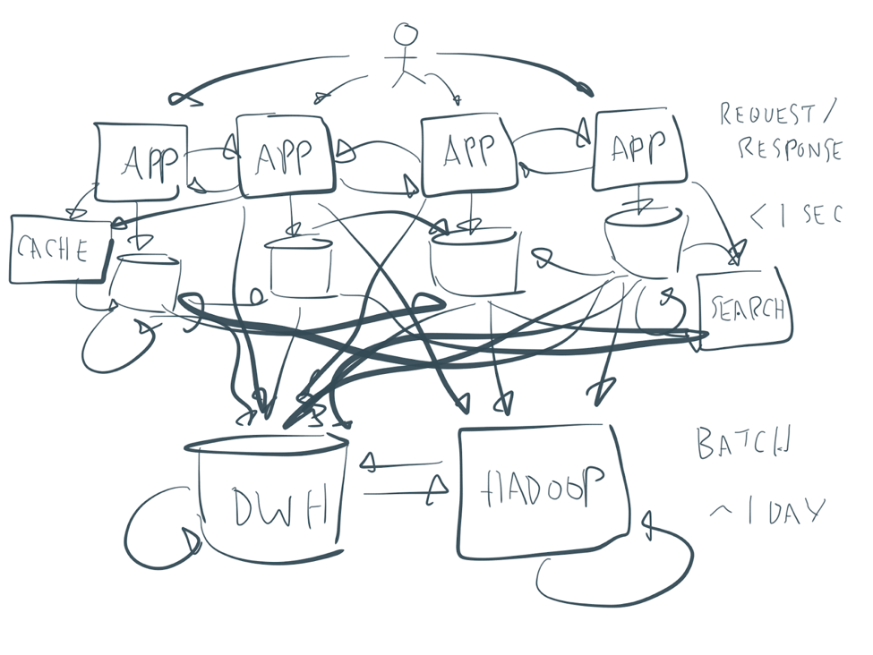

# adidas Asynchronous API guidelines

## Basic concepts about asynchronous APIs

### Event-driven architectures

#### What is an event-driven architecture

Event-Driven Architectures (EDAs) are a paradigm that promotes the production, consumption and reaction to events.

This architectural pattern may be applied by the design and implementation of applications and systems that transmit events amongst loosely coupled software components and services. 

An event-driven system typically consists of event emitters (or agents), event consumers (or sinks), and event channels.

- Producers (or publishers) are responsible for detecting, gathering and transferring events
    - Are not aware of consumers
    - Are not aware of how the events are consumed
- Consumers (or subscribers) react to the events as soon as they are produced
    - The reaction can be self-contained or it can be a composition of processes or components
- Event channels are conduits in which events are transmited from emitters to consumers

**Note** Producer and Consumer role is not exclusive. In other words, the same client or application can be producer and consumer at the same time.

In most cases, EDAs are broker-centric, as seen in the diagram below. 

#### Problem statement

Typically, the architectural landscape of a big company grows in complexity and as a result of that it is possible to end up with a bunch of direct connections between a myriad of different components or modules.

By using streaming patterns, it is possible to get a much cleaner architecture

It is important to take into account that EDAs are not a silver bullet, and there are situations in which this kind of architectures might not fit very well. 

One example is systems that heavily rely on transactional operations... of course it might be possible to use EDA but most probably the complexity of the resulting architecture would be too high.

Also, it is important to note that it is possible to mix request-driven and event-driven protocols in the same system. For example,

- Online services that interact directly with a user fits better into the synchronous communication but they also can generate events into Kafka.
- On the other hand, offline services (billing, fulfillment, etc) are typically built purely with events.

#### Kafka as the heard of EDAs

There are several technologies to implement event-driven architectures, but this section is going to focus on the predominant technology on this subject : Apache Kafka.

**Apache Kafka** can be considered as a Streaming Platform which relies on the several concepts:

- Super high-performance, scalable, highly-available cluster of brokers
    - Availability
        - Replication of partitions across different brokers
    - Scalability
        - Partitions
        - Ability to rebalance partitions across consumers automatically when adding/removing them
    - Performance
        - Partitioned, replayable log (collection of messages appended sequentially to a file)
        - Data copied directly from disk buffer to network buffer (zero copy) without even being imported to the JVM
        - Extreme throughput by using the concept of consumer group and
    - Security
        - Secure encrypted connections using TLS client certificates
        - Multi-tenant management through quotas/acls
    - Client APIs on different programming languages : Go, Scala, Python, REST, JAVA, ...
    - Stream processing APIs (currently Kafka Streams and ksqlDB)
    - Ecosystem of connectors to pull/push data from/to Kafka
    - Clean-up processes for storage optimization
        - Retention periods
        - Compacted topics

### Basic terminology

#### Events

An event is both a fact and a notification, something that already happened in the real world.

- No expectation on any future action
- Includes information about a status change that just happened
- Travels in one direction and it never expects a response (fire and forget)
- Very useful when...
    - Loose coupling is important
    - When the same piece of information is used by several services
    - When data needs to be replicated across application

A message in general is any interaction between an emitter and a receiver to exchange information. This implies that any event can be considered a messages but not the other way around.

#### Commands

A command is a special type of message which represents just an action, something that will change the state of a given system.

- Typically synchronous
- There is a clear expectation about a state change that needs to take place in the future
- When returning a response indicate completion
- Optionally they can include a result in the response
- Very common to see them in orchestration components 

#### Query

It is a special type of message which represents a request to look something up.

- They are always free of side effects (leaves the system unchanged)
- They always require a response (with the requested data)

#### Coupling

The term coupling can be understood as the impact that a change in one component will have on other components. In the end, it is related to the amount of things that a given component shares with others. The more is shared, the more tight is the coupling.

**Note** A tighter coupling is not necessarily a bad thing, it depends on the situation. It will be necessary to assess the tradeoff between provide as much information as possible and to avoid having to change several components as a result of something changing in other component.

The coupling of a single component is actually a function of these factors:

- Information exposed (Interface surface area)
- Number of users
- Operational stability and performance
- Frequency of change 

Messaging helps bulding loosely coupled services because it moves pure data from a highly coupled location (the source) and puts it into a loosely coupled location (the subscriber). 

Any operations that need to be performed on the data are done in each subscriber and never at the source. This way, messaging technologies (like Kafka) take most of the operational issues off the table.

All business systems in larger organizations need a base level of essential data coupling. In other words, functional couplings are optional, but core data couplings are essential.

#### Bounded context

A bounded context is a small group of services that share the same domain model, are usually deployed together and collaborate closely.

It is possible to put an analogy here with a hierarchic organization inside a company : 

- Different departments are loosely coupled
- Inside departments there will be a lot more interactions across services and the coupling will be tighter

One of the big ideas of Domain-Driven Design (DDD) was to create boundaries around areas of a business domain and model them separately. So within the same bounded context the domain model is shared and everything is available for everyone there. 

However, different bounded contexts don't share the same model and if they need to interact they will do it through more restricted interfaces.

#### Stream processing

It can be understood as the capability of processing data directly as it is produced or received (hence, in real-time or near to real-time).

[Review]

A message carries information from one application to another, while an event is a message that provides details of something that has already occurred. One important aspect to note is that depending on the type of information a message contains, it can fall under an event, query, or command.

Overall, events are messages but not all messages are events.

### Using events in an EDA

There are several ways to use events in a EDA:

- Events as notifications
- Events to replicate data

#### Events as notifications

When a system uses events as notifications it becomes a pluggable system. The producers have no knowledge about the consumers and they don't really care about them, instead every consumer can decide if it is interested in the information included in the event. 

This way, the number of consumers can be increased (or reduced) without changing anything on the producer side.

This pluggability becomes increasily important as systems get more complex.

#### Events to replicate data

When events are used to replicate data across services, they include all the necessary information for the target system to keep it locally so that it can be queried with no external interactions. 

This is usually called event-carried state transfer which in the end is a form of data integration. 

The benefits are similar to the ones implied by the usage of a cache system

- Better isolation and autonomy, as the data stays under service's control
- Faster data access, as the data is local (particularly important when combining data from different services in different geographies)
- Offline data availability
