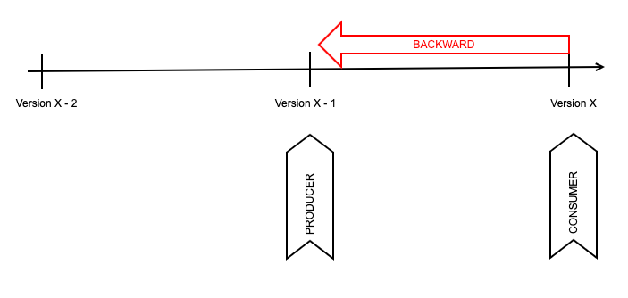

# adidas Asynchronous API guidelines

## Asynchronous API guidelines

This document is biased towards Kafka, which is the technology used in adidas for building Event Driven Architectures.

### Contract

The definition of an asynchronous API **MUST** represent a contract between API owners and the stakeholders. 

That contract **MUST** contain enough information to use the API (servers, URIs, credentials, contact information, etc) and to identify which kind of information is being exchanged there.

### API First

Asynchronous APIs **SHOULD** use the API First principle :

- The API designs **SHOULD** involve all relevant stakeholders (developers, consumers, ...) to ensure that final design fulfil requirements from different perspectives
- The resulting API specification will be the source of truth rather than the API implementation

### Immutability

After agreement with the stakeholders the contract **MUST** be published in order to do it immutable. Changes to the API related to the data model, **MUST** be published in a schema registry. 

Schema registry acts as a central location for storing and accessing the schemas of all published APIs.

### Common data types

The API types **MUST** adhere to the formats defined below:

| Data type | Standard | Example |
| --------- | -------- | ------- |  
| Date and Time | [ISO 8601](https://en.wikipedia.org/wiki/ISO_8601) | 2017-06-21T14:07:17Z (Always use UTC) |
| Date | [ISO 8601](https://en.wikipedia.org/wiki/ISO_8601) | 2017-06-21 |
| Duration | [ISO 8601](https://en.wikipedia.org/wiki/ISO_8601) | P3Y6M4DT12H30M5S |
| Time interval | [ISO 8601](https://en.wikipedia.org/wiki/ISO_8601) | 2007-03-01T13:00:00Z/2008-05-11T15:30:00Z |
| Timestamps | [ISO 8601](https://en.wikipedia.org/wiki/ISO_8601) | 2017-01-01T12:00:00Z |
| Language Codes | [ISO 639](https://en.wikipedia.org/wiki/List_of_ISO_639-1_codes) | en <-> English |
| Country Code | [ISO 3166-1 alpha-2](https://en.wikipedia.org/wiki/ISO_3166-1_alpha-2) | DE <-> Germany |
| Currency | [ISO 4217](https://en.wikipedia.org/wiki/ISO_4217) | EUR <-> Euro |

### Automatic schema registration

Applications **MUST NOT** enable automatic registration of schemas because FDP's operational model for the Schema Registry relies on GitOps (every operation is done through GIT PRs + automated pipelines)

### Schemas and data evolution

All asynchronous APIs **SHOULD** leverage Schema Registry to ensure consistency across consumers/producers with regards to message structure and ensuring compatibility across different versions. 

The default compatibility mode in Schema Registry is FULL_TRANSITIVE. This is the more restrictive compatibility mode, but others are also available. More on this on the subsection below.

 #### Compatibility modes

Once a given schema is defined, it is unavoidable that the schema evolves with time. Everytime this happens, downstream consumers need to be able to handle data with both old and new schemas seamlessly.

Each new schema version is validated according to the configuration before being created as a new version. Namely, it is checked against the configured compatibility types (see below).

**Important** The mere fact of enabling Schema Registry is not enough to ensure that there are no compatibility issues in a given integration. The right compatibility mode needs also to be selected and enforced.

As a summary, the available compatibility types are listed below:

| Mode | Description |
|------|-------------|
|BACKWARD|new schema versions are backward compatible with older versions|
|BACKWARD_TRANSITIVE|backward compatibility across all schema versions, not just the latest one.|
|FORWARD|new schema versions are compatible with older consumer versions|
|FORWARD_TRANSITIVE|forward compatibility across all schema versions.|
|FULL|both backward and forward compatibility with the latest schema version|
|FULL_TRANSITIVE|both backward and forward compatibility with all schema versions|
|NONE|schema compatibility checks are disabled|

#### Backward compatibility

There are two variants here:

- BACKWARD - Consumers using a new version (X) of a schema can read data produced by the previous version (X - 1)
- BACKWARD_TRANSITIVE - Consumers using a new version (X) of a schema can read data produced by any previous version (X - 1, X - 2, ....)

The operations that preserve backward compatibility are:

- Delete fields
    - Consumers with the newer version will just ignore the non-existing fields
- Add optional fields (with default values)
    - Consumers will set the default value for the missing fields in their schema version

#### Forward compatibility

Also two variants here:

- FORWARD - Consumers with previous version of the schema (X - 1) can read data produced by Producers with a new schema version (X)
- FORWARD_TRANSITIVE - Consumers with any previous version of the schema (X - 1, X - 2, ...) can read data produced by Producers with a new schema version (X)

The operations that preserve forward compatibility are:

- Adding a new field
    - Consumers will ignore the fields that are not defined in their schema version
- Delete optional fields (with default values)
    - Consumers will use the default value for the missing fields defined in their schema version

 
#### Full compatibility
 
This is a combination of both compatibility types (backward and forward). It also has 2 variants:

- FULL - Backward and forward compatible between schemas X and X - 1.
- FULL_TRANSITIVE - Backward and forward compatible between schemas X and all previous ones (X - 1, X - 2, ...)

**Important** FULL_TRANSITIVE is the default compatibility mode in FDP, it is set at cluster level and all new schemas will inherit it

This mode is preserved only if using the following operations

- Adding optional fields (with default values)
- Delete optional fields (with default values)

#### Upgrading process of clients based on compatibility 

Depending on the compatibility mode, the process of upgrading producers/consumers will be different based on the compatibility mode enabled.

- NONE
    - As there are no compatibility checks, no order will grant a smooth transition
    - In most of the cases this lead to having to create a new topic for this evolution
- BACKWARD / BACKWARD_TRANSITIVE
    - Consumers **MUST** be upgraded first before producing new data
    - No forward compatibility, meaning that there's no guarantee that the consumers with older schemas are going to be able to read data produced with a new version
- FORWARD / FORWARD_TRANSITIVE
    - Producers **MUST** be upgraded first and then after ensuring that no older data is present, upgrade the consumers
    - No backward compatibility, meaning that there's no guarantee that the consumers with newer schemas are going to be able to read data produced with an older version
-  FULL / FULL TRANSITIVE
    - No restrictions on the order, anything will work

 #### How to deal with breaking changes

If for any reason you need to use a less strict compatibility mode in a topic, or you can't avoid breaking changes in a given situation, the compatibility mode **SHOULD NOT** be modified on the same topic. 

Instead, a new topic **SHOULD** be used to avoid unexpected behaviors or broken integrations. This allows a smooth transitioning from clients to the definitive topic, and once all clients are migrated the original one can be decommissioned.

Alternatively, instead of modifying existing fields it **MAY** be considered as an suboptimal approach to add the changes in new fields and have both coexisting. Take into account that this pollutes your topic and it can cause some confusion. 

 ### Key/Value message format

 Kafka messages **MAY** include a key, which needs to be properly designed to have a good balance of data across partitions.

The message key and the payload (often called value) can be serialized independently and can have different formats. For example, the value of the message can be sent in AVRO format, while the message key can be a primitive type (string). 

Message keys **SHOULD** be kept as simple as possible and use a primitive type when possible.

### Message headers

In addition to the key and value, a Kafka message **MAY** include ***headers***, which allow to extend the information sent with some metadata as needed (for example, source of the data, routing or tracing information or any relevant information that could be useful without having to parse the message).

Headers are just an ordered collection of key/value pairs, being the key a String and the value a serialized Object, the same as the message value itself.

### Naming conventions

As general naming conventions, asynchronous APIs **MUST** adhere to the following conventions

- Use of english
- Avoid acronyms or explain them when used
- Use camelCase unless stated otherwise

### Protocols

Protocols define how clients and servers communicate in an asynchronous architecture.

The accepted protocols for asynchronous APIs are:

- Kafka
- HTTPs
- WebSockets
- MQTT

This version of the guidelines focuses on Kafka protocol, but it could be extended in the future. In any case, this document will be updated to reflect the state of the art.

### Security

The [security guidelines](https://github.com/adidas/api-guidelines/blob/feature/asyncapi-guidelines/general-guidelines/security.md) for regular APIs **MUST** be followed strictly when applicable.

