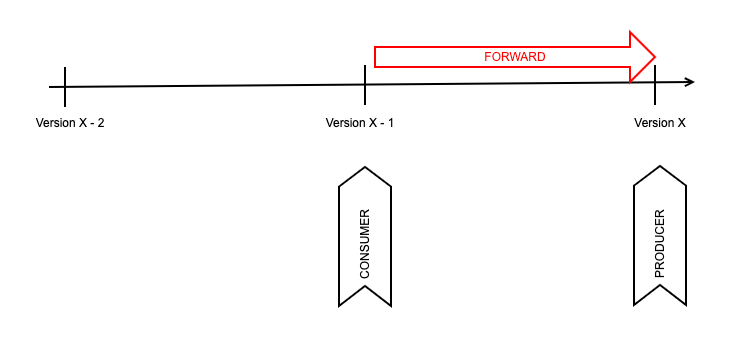

# Forward Compatibility

Also two variants here:

* FORWARD - Consumers with previous version of the schema (X - 1) can read data produced by Producers with a new schema version (X)
* FORWARD\_TRANSITIVE - Consumers with any previous version of the schema (X - 1, X - 2, ...) can read data produced by Producers with a new schema version (X)

The operations that preserve forward compatibility are:

* Adding a new field
  * Consumers will ignore the fields that are not defined in their schema version
* Deleting optional fields (with default values)
  * Consumers will use the default value for the missing fields defined in their schema version

<figure><figcaption></figcaption></figure>
