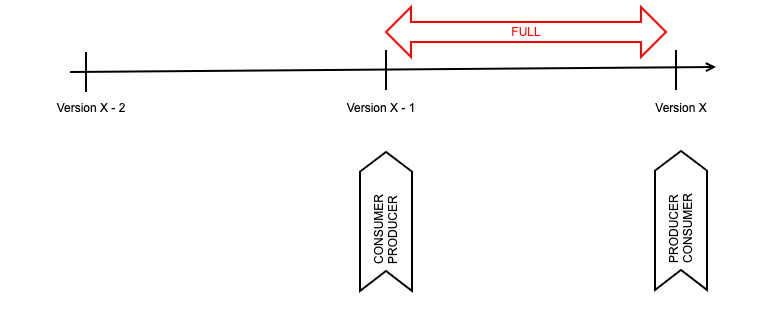

# Full Compatibility

This is a combination of both compatibility types (backward and forward). It also has 2 variants:

* FULL - Backward and forward compatible between schemas X and X - 1
* FULL\_TRANSITIVE - Backward and forward compatible between schemas X and all previous ones (X - 1, X - 2, ...)

**Important** Once more, FULL\_TRANSITIVE is the default compatibility mode in adidas, it is set at cluster level and all new schemas will inherit it

This mode is preserved only if using the following operations

* Adding optional fields (with default values)
* Deleting optional fields (with default values)

<figure><figcaption></figcaption></figure>
